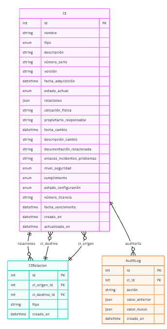

#### Eduardo Josué González Cifuentes
#### 201900647

# API CMDB


## Configuración
1. Instalar dependencias: `pip install -r requirements.txt`
2. Configurar base de datos PostgreSQL en `src/database/db.py`
3. Ejecutar migraciones: `Base.metadata.create_all(bind=engine)`
4. Cargar datos iniciales: `python scripts/seed.py`
5. Iniciar servidor: `uvicorn main:app --reload`

## Endpoints
#### POST /cis - Crear un nuevo CI

- **Endpoint**: `POST /cis`
- **Descripción**: Registra un nuevo elemento de configuración en la CMDB.
- **Solicitud**:
  - **Body** (application/json):
    ```json
    {
        "nombre": "ServidorPrueba",
        "tipo": "Hardware",
        "descripción": "Servidor de prueba",
        "número_serie": "SN789101",
        "versión": "v1.0",
        "fecha_adquisición": "2022-01-01T00:00:00",
        "estado_actual": "Activo",
        "relaciones": {"padres": [], "hijos": []},
        "ubicación_física": "Sala de Servidores",
        "propietario_responsable": "Equipo Infraestructura",
        "fecha_cambio": "2022-02-01T00:00:00",
        "descripción_cambio": "Instalación inicial",
        "documentación_relacionada": "Enlace a Manual[url]",
        "enlaces_incidentes_problemas": "Enlace a incidente[url]",
        "nivel_seguridad": "Alto",
        "cumplimiento": "Cumple",
        "estado_configuración": "Aprobado",
        "número_licencia": "TEST123",
        "fecha_vencimiento": "2023-01-01T00:00:00"
    }
    ```
- **Respuesta**:
  - **Código**: `200 OK`
  - **Body**:
    ```json
    {
        "id": 1,
        "nombre": "ServidorPrueba",
        "tipo": "Hardware",
        "descripción": "Servidor de prueba",
        "número_serie": "SN789101",
        "versión": "v1.0",
        "fecha_adquisición": "2022-01-01T00:00:00",
        "estado_actual": "Activo",
        "relaciones": {"padres": [], "hijos": []},
        "ubicación_física": "Sala de Servidores",
        "propietario_responsable": "Equipo Infraestructura",
        "fecha_cambio": "2022-02-01T00:00:00",
        "descripción_cambio": "Instalación inicial",
        "documentación_relacionada": "Enlace a Manual[url]",
        "enlaces_incidentes_problemas": "Enlace a incidente[url]",
        "nivel_seguridad": "Alto",
        "cumplimiento": "Cumple",
        "estado_configuración": "Aprobado",
        "número_licencia": "TEST123",
        "fecha_vencimiento": "2023-01-01T00:00:00",
        "creado_en": "2025-06-22T22:22:00",
        "actualizado_en": "2025-06-22T22:22:00"
    }
    ```
  - **Errores**:
    - `400 Bad Request`: Si los datos enviados son inválidos.
    - `500 Internal Server Error`: Error en el servidor.
#### GET /cis - Listar todos los CIs

- **Endpoint**: `GET /cis`
- **Descripción**: Devuelve una lista de todos los CIs, con opción de filtrado por `tipo` y `estado_actual`.
- **Parámetros de Consulta**:
  - `tipo` (opcional): Filtra por tipo (e.g., "Hardware", "Software").
  - `estado_actual` (opcional): Filtra por estado (e.g., "Activo", "Inactivo").
- **Solicitud**:
  - URL: `http://localhost:8000/cis?tipo=Hardware&estado_actual=Activo`
- **Respuesta**:
  - **Código**: `200 OK`
  - **Body** (ejemplo):
    ```json
    [
        {
            "id": 1,
            "nombre": "Servidor1",
            "tipo": "Hardware",
            "estado_actual": "Activo",
            // ... otros campos
        }
    ]
    ```
  - **Errores**:
    - `500 Internal Server Error`: Error en el servidor.

#### GET /cis/{id} - Obtener un CI específico
- **Endpoint**: `GET /cis/{ci_id}`
- **Descripción**: Recupera los detalles de un CI específico por su ID.
- **Parámetros**:
  - `ci_id` (path): Identificador único del CI.
- **Solicitud**:
  - URL: `http://localhost:8000/cis/1`
- **Respuesta**:
  - **Código**: `200 OK`
  - **Body**: Igual que la respuesta de creación (ver arriba).
  - **Errores**:
    - `404 Not Found`: Si el CI no existe.
    - `500 Internal Server Error`: Error en el servidor.

#### PUT /cis/{id} - Actualizar un CI
- **Endpoint**: `PUT /cis/{ci_id}`
- **Descripción**: Actualiza los datos de un CI existente.
- **Parámetros**:
  - `ci_id` (path): Identificador único del CI.
- **Solicitud**:
  - **Body** (application/json):
    ```json
    {
        "nombre": "Servidor1 Actualizado",
        "estado_actual": "Inactivo"
    }
    ```
- **Respuesta**:
  - **Código**: `200 OK`
  - **Body**: Datos actualizados del CI.
  - **Errores**:
    - `404 Not Found`: Si el CI no existe.
    - `400 Bad Request`: Si los datos son inválidos.
    - `500 Internal Server Error`: Error en el servidor.

#### DELETE /cis/{id} - Eliminar un CI
- **Endpoint**: `DELETE /cis/{ci_id}`
- **Descripción**: Elimina un CI de la CMDB.
- **Parámetros**:
  - `ci_id` (path): Identificador único del CI.
- **Solicitud**:
  - URL: `http://localhost:8000/cis/1`
- **Respuesta**:
  - **Código**: `200 OK`
  - **Body**:
    ```json
    {
        "mensaje": "CI eliminado"
    }
    ```
  - **Errores**:
    - `404 Not Found`: Si el CI no existe.
    - `500 Internal Server Error`: Error en el servidor.
#### POST /relaciones - Crear una relación entre CIs
- **Endpoint**: `POST /relaciones`
- **Descripción**: Establece una relación entre dos CIs (ej. "ALOJA", "DEPENDE").
- **Solicitud**:
  - **Body** (application/json):
    ```json
    {
        "ci_origen_id": 1,
        "ci_destino_id": 2,
        "tipo": "ALOJA"
    }
    ```
- **Respuesta**:
  - **Código**: `200 OK`
  - **Body**:
    ```json
    {
        "id": 1,
        "ci_origen_id": 1,
        "ci_destino_id": 2,
        "tipo": "ALOJA",
        "creado_en": "2025-06-22T22:22:00"
    }
    ```
  - **Errores**:
    - `400 Bad Request`: Si los IDs no existen o los datos son inválidos.
    - `500 Internal Server Error`: Error en el servidor.
## Modelos
- CI: nombre, tipo (Hardware/Software), descripción, número_serie, versión, fecha_adquisición, estado_actual, relaciones, ubicación_física, propietario_responsable, etc.
- Relación: ci_origen_id, ci_destino_id, tipo
- AuditLog: ci_id, acción, valor_anterior, valor_nuevo, creado_en

## Pruebas
Ejecutar pruebas: `pytest src/tests/`